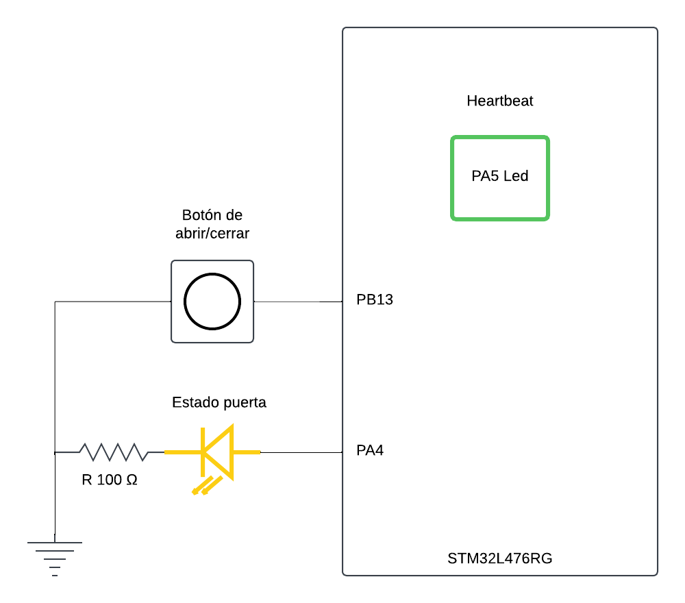
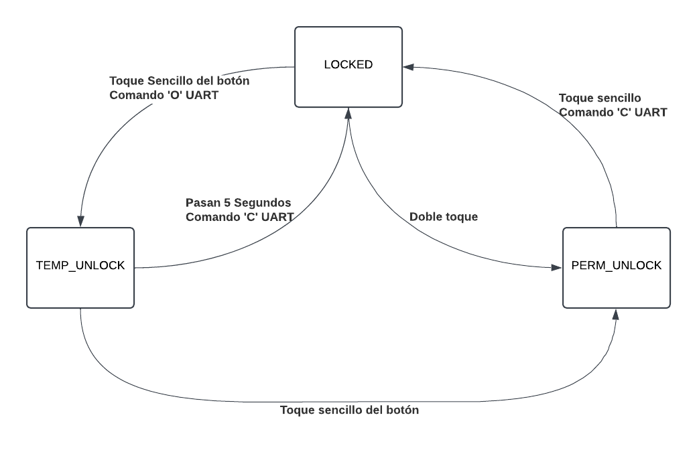

# Sistema de Control de Acceso (Configuración de Ejemplo)

Este README describe un sistema de control de acceso simplificado implementado en una placa STM32 Nucleo. El sistema emula un mecanismo de puerta segura con indicaciones básicas, eventos de entrada y capacidades de control/monitoreo remoto vía UART.

## Recursos de Hardware
### Pines relevantes:

| PIN  | Función          | Conexión                                |
|------|------------------|-----------------------------------------|
| PA2  | UART2 Tx         | Directamente a ST Link (por defecto)    |
| PA3  | UART2 Rx         | Directamente a ST Link (por defecto)    |
| PA4  | LED de Estado    | resistencia 100Ω -> LED amarillo -> GND |
| PA5  | LED de heartbeat | Led por defecto en la STM32L476RG       |
| PB13 | Boton de control | boton pulsador -> GND                   |

### Descripción del hardware

- **LED de Latido (Heartbeat)**: Un LED dedicado que parpadea periódicamente (cada 500 ms) para indicar que el sistema está funcionando correctamente.
- **LED de Estado de la Puerta**: Indica el estado actual de la puerta:
  - Encendido (fijo): La puerta está desbloqueada (temporal o permanentemente).
  - Apagado: La puerta está bloqueada.
  
- **Botón de Abrir/Cerrar Puerta**:  
  - Pulsación Sencilla: Desbloquea temporalmente la puerta (por un tiempo predefinido, ej. 5 segundos).
  - Doble Pulsación: Desbloquea la puerta de forma permanente hasta recibir un comando de cierre (por UART u boton de control).

- **UART**:  
  - Recibe comandos como `O` (OPEN) para abrir y `C` (CLOSE) para cerrar desde un sistema externo (PC u otro controlador).
  - Envía eventos de registro como `DOOR_UNLOCKED` y `DOOR_LOCKED`.

**Opcional**:  
- **Botón de Timbre (Ring Bell)**: Pulsar este botón podría generar un evento de “timbre” (`BELL_RING`) enviado por UART u otra acción definida por la aplicación. Este botón es opcional y no afecta la lógica principal del control de la puerta.

## Operación a Alto Nivel

0. **Siempre:**
    - El LED de heartbeat parpadea periodicamente.

1. **Inactivo (Bloqueado)**:
   - El LED de Estado de la Puerta está apagado.
   - El sistema espera eventos:
     - Pulsación sencilla del botón de abrir/cerrar: Desbloqueo temporal.
     - Doble pulsación del botón de abrir/cerrar: Desbloqueo permanente.
     - Comando UART:
       - `O` (OPEN): Desbloquear la puerta.
       - `C` (CLOSE): Bloquear la puerta (si está desbloqueada).

2. **Desbloqueado Temporalmente**:  
   - El LED de Estado de la Puerta se enciende (fijo).
   - Inicia un temporizador (ej. 5 segundos). Al expirar, la puerta se vuelve a bloquear (LED apagado) y se envía `DOOR_LOCKED`.
   - Una pulsación adicional del botón antes de que el tiempo expire puede cambiar a modo desbloqueo permanente.
   - Un comando `C` vía UART bloquea inmediatamente la puerta.

3. **Desbloqueado Permanentemente**:  
   - El LED de Estado de la Puerta se enciende (fijo).
   - La puerta permanece desbloqueada indefinidamente hasta que:
     - Se reciba un comando `C` (CLOSE) por UART.
     - Una pulsación sencilla del botón de abrir/cerrar indique volver a bloquear.

## Características de la documentación:
- Cada función exportada en los archivos de headers está documentada en  funcionalidad, entrada y salida.
- Se añaden diagramas de flujo para ilustrar el funcionamiento del sistema.
- Se complementan tablas de información de los pines para facilitar la conexión de los periféricos.
